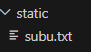

# Code With Harry Tutorial on Flask
## How to set port no?
Set ```app.run(debug=True,port=any_number)```

**Example:**
``` python
if __name__ == '__main__':
 app.run(debug=True,port=8000)
```
Output:
```
* Running on http://127.0.0.1:8000
```
Note: If we set port no as default, it again set to 5000
## Adding pages in router
**Syntax:**
``` python
@app.route('/page_name')
def page_content():
  #body
```
**Example:**
``` python
@app.route('/products')
def products():
    return 'This is a products page'
```
Output:\
\

## Static and Template folders
- Static files are used to store and run the files in website as it is.<br> 
- Teplates are used to save html files to render them.

**Putting a file into static Folder:**\
\
Let's put a file inside static folder\
\
\
\
Now let's open ```subu.txt``` the static page running ```http://127.0.0.1:5000/static/subu.txt```\
\

## HTML Rendering
Let's put our html document in templates folder\
\
For HTML rendering we need to import sub-package ```render_template```
``` python
from flask import Flask,render_template
```
Let's write some simple code in our html file ```design.html```
``` html
<!DOCTYPE html>
<html lang="en">
<head>
    <meta charset="UTF-8">
    <meta name="viewport" content="width=device-width, initial-scale=1.0">
    <title>Document</title>
</head>
<body>
    <p>This is HTML website</p>
</body>
</html>
```
Now let's render our html file
``` python 
@app.route('/')
def hello_world():
    return render_template('design.html')
```
Output:\
\
\
## Modifying html file using Bootstrap
Go to the website [getbootstrap](https://getbootstrap.com/)\
It's a website designed to make easy to design websites by providing templates\
Copy and paste the starter template code given below to ```design.html```
``` html
<!doctype html>
<html lang="en">
  <head>
    <meta charset="utf-8">
    <meta name="viewport" content="width=device-width, initial-scale=1">
    <title>Bootstrap demo</title>
    <link href="https://cdn.jsdelivr.net/npm/bootstrap@5.3.3/dist/css/bootstrap.min.css" rel="stylesheet" integrity="sha384-QWTKZyjpPEjISv5WaRU9OFeRpok6YctnYmDr5pNlyT2bRjXh0JMhjY6hW+ALEwIH" crossorigin="anonymous">
  </head>
  <body>
    <h1>Hello, world!</h1>
    <script src="https://cdn.jsdelivr.net/npm/bootstrap@5.3.3/dist/js/bootstrap.bundle.min.js" integrity="sha384-YvpcrYf0tY3lHB60NNkmXc5s9fDVZLESaAA55NDzOxhy9GkcIdslK1eN7N6jIeHz" crossorigin="anonymous"></script>
  </body>
</html>
```
After running the website we get\
\
## Components of Bootstrap
Now let's explore the [components](https://getbootstrap.com/docs/5.3/getting-started/introduction/) of bootstrap.\
\
**Navbar:**\
Copy the code for [Navbar](https://getbootstrap.com/docs/5.3/components/navbar/)\
Paste the code in body of ```design.html``` by removing the hello world part.\
After running we get our website as\
\
Let's change the title to 'MyTodo'\

Tricks: \
1.Right click and then click format document to fix the indents in html file.\
2.To collapse a big code click as shown here\
\
\
**Form:**\
Let's make a container class in our html file.
``` html
  <div class="container"></div>
```
Let's copy the email address and password in [form](https://getbootstrap.com/docs/5.3/forms/overview/) page and paste the form in our container.\
After running we get.\
\
If we want the email address and password form to occupy the full width then we will use ```container-fluid``` class.
``` html
<div class="container-fluid"></div>
```
After running we get.\
\
\
**Table:**\
Let's copy the html code for [table](https://getbootstrap.com/docs/5.3/content/tables/#overview) and paste it by creating another container class.\
/
**Spaces/Margins between container:**\
Note down the [notations](https://getbootstrap.com/docs/5.2/utilities/spacing/#notation) and write them in the given format
``` html
<div class="container mb-3"></div>
<!--Creates a margin of size 3 at the bottomm-->
```
Note: These can take integer values from 0 to 5 only
``` html
<div class="container mb-6"></div>
<!--Incorrect since 6 lies out of the range from 0 to 5-->
<div class="container mb-1.5"></div>
<!--Incorrect since 1.5 is not integer-->
<div class="container mb-3"></div>
<!--Correct-->
```
**Making a Todo App:**\
Edit the email and password container to Todo Tite and Todo description as this
``` html
<h2>Add a Todo</h2>
    <form>
      <div class="mb-3">
        <label for="title" class="form-label">Todo title</label>
        <input type="text" class="form-control" id="title" aria-describedby="emailHelp">
      </div>
      <div class="mb-3">
        <label for="desc" class="form-label">Todo description</label>
        <input type="text" class="form-control" id="desc">
      </div>
      <button type="submit" class="btn btn-primary">Submit</button>
    </form>
<!--label for and input id must be same-->
```
Edit '#' in table to 'Sl.no'\
So this how it looks\

## Creating a database
For this purpose, we need to instal the package
```flask-sqlalchemy```
``` 
pip install flask-sqlalchemy
```
then import the sub-package ```SQLAlchemy```
``` python
from flask_sqlalchemy import SQLAlchemy
```
**1.Initialising database:**\
To initialise the SQLAlchemy we need [configuration key](https://flask-sqlalchemy.palletsprojects.com/en/3.1.x/config/#configuration-keys) and [link of database](https://flask-sqlalchemy.palletsprojects.com/en/3.1.x/config/#connection-url-format) as an example given below.
``` python
app.config['SQLALCHEMY_DATABASE_URI']="sqlite:///todo.db"
#For database URL
app.config['SQLALCHEMY_TRACK_MODIFICATIONS']=False
#To track modifications in Database
```
**2.Defining schema**\
Let's define the schema of our database using a class 'Todo'.
``` python
class Todo(db.Model):
    slno=db.Column(db.Integer,primary_key=True)
    title=db.Column(db.String(200),nullable=True)
    desc=db.Column(db.String(500),nullable=True)
    date_created=db.Column(db.DateTime,default=datetime.utcnow)

    def __repr__(self) -> str:
        return f"{self.slno}-{self.title}"
```
**3.Creating .db file by running python in terminal**\
Run the following code in the terminal after opening python in the terminal
``` python
>> from file_name import db
>> db.create_all()
#Create a folder instance containing .db file
```
After running our command, we got our .db File in instance folder\
\
\
Now open [sqllite viewer](https://inloop.github.io/sqlite-viewer/) where you can upload your .db file and view details about it as you can see below.\


**4.Adding rows:**\
We can add rows to our databasein the even way to our database
``` python
Object_name= Class_name(att1=val1,att2=val2,...,attn=valn)
db.session.add(Object_name)
db.session.commit()
#Entering values 
```
For updating and deleting refer the [documentation](https://flask-sqlalchemy.palletsprojects.com/en/3.1.x/queries/#insert-update-delete)

To print the rows we can use the syntax below
``` python
@app.route('/show')
def products():
    allTodo=Todo.query.all()
    print(allTodo)
```
As soon as we open ```http://127.0.0.1:5000/show```
the output is as shown below displaying all rows\
\
It displays all the rows, since it executes ```__repr__()```\
## Using Jinja2
Download the extension ```Jinja2 Snippet Kit``` to enable Jinja templating.\
\
Jinja2 is a templating engine\
**1.Showing our Database in Website**\
Let's use ```jfor``` in body of our table
``` html
<tbody> 
     
       <!--Code-->   
     
</tbody>
```
Example:\
``` python
@app.route('/')
def hello_world():
    todo=Todo(title='First todo',desc='gandi dhoibi')
    db.session.add(todo)
    db.session.commit()
    allTodo=Todo.query.all()
    return render_template('design.html',allTodo=allTodo)
```
``` html
      <tbody>
        
        <tr>
          <th scope="row">{{todo.slno}}</th>
          <td>{{todo.title}}</td>
          <td>{{todo.desc}}</td>
          <td>{{todo.date_created}}</td>
        </tr>
        
      </tbody>
```
Output:\
\
**2.Making a workable database:**\
Suppose we delete the 8th row So after 7th row 9th row will come,due to which our serial number becomes discontinuous.\
So we would use ```{{loop.index}}```.
``` html

        <tr>
          <th scope="row">{{loop.index}}</th>
          <td>{{todo.title}}</td>
          <td>{{todo.desc}}</td>
          <td>{{todo.date_created}}</td>
        </tr>
        
```
In ```Add a Todo``` form we will add some functionalities
``` html []
<form action="/" method="post">
```
``` python
from flask import request
```
``` python []
@app.route('/')
def hello_world():
    if request.method=='post':
        print('post')
#error
```


``` python 
@app.route('/',methods=['GET','POST'])
def hello_world():
    if request.method=='post':
        print('post')
#'post' will not be printed if we click the submit button
```
Printing title
``` html
<input type="text" class="form-control" name='title' id="title" aria-describedby="emailHelp">
<input type="text" class="form-control" name="desc" id="desc">
<!--Naming title and desc container as title and desc-->
```
``` python
def hello_world():
    if request.method=='POST':
        print(request.form['title'])
```
\
After clicking submit
``` 
127.0.0.1 - - [05/Jun/2024 14:55:28] "POST / HTTP/1.1" 200 -
hello123
```
``` python
if request.method=='POST':
        title =request.form['title']
        desc=request.form['desc']
        todo=Todo(title=title,desc=desc)
```
Delete ```todo.do``` and reinstall it using
``` python
if __name__ == "__main__":
    with app.app_context():
        db.create_all()
```
``` html
<th scope="col">Actions</th>
```
``` html
<td><a href="/delete/{{todo.slno}}" type="button" class="btn btn-outline-dark btn-sm mx-1">Delete</button>
            <a href="/update/{{todo.slno}}" type="button" class="btn btn-outline-dark btn-sm mx-1">Update</button>
          </td>
```
[Outline buttons](https://getbootstrap.com/docs/5.3/components/buttons/#outline-buttons)\
If ```app.run(debug=True)``` and we can also rerun the website to show the output of the updated code
\
if ```debug=False``` Doesn't show the output of the updated code if we rerun\

``` python
from flask import redirect
@app.route('/delete/<int:slno>')
def delete(slno):
    todo=Todo.query.filter_by(slno=slno).first()
    db.session.delete(todo)
    db.session.commit()
    return redirect('/')
```
``` html

          no record
        
        <thead>
          <tr>
            <th scope="col">Sl.no</th>
            <th scope="col">Title</th>
            <th scope="col">Description</th>
            <th scope="col">Time</th>
            <th scope="col">Actions</th>
          </tr>
        </thead>
        
```
\
[Alert](https://getbootstrap.com/docs/5.3/components/alerts/#examples)
``` html
 
        <div class="alert alert-dark" role="alert">
          No todos found. Add more todos.
        </div>
```
\
Making update endpoint\

We will use the concept of ```template inheritance``` in Jinja\
Let's create a base html file ```base.html``` 
Containing all common Templates.
## Template inheritance
\
\
\
**UPDATE:**\
Make a new file ```update.html```\
``` html
<form action="/update/{{todo.slno}}" method="POST">
```
``` html
 <input type="text" class="form-control" name='title' id="title" value="{{todo.title}}" aria-describedby="emailHelp">
```
``` html
<input type="text" class="form-control" name="desc" value="{{todo.desc}}" id="desc">
```
``` python
@app.route('/update/<int:slno>',methods=['GET','POST'])
def update(slno):
    if request.method=='POST':
        title =request.form['title']
        desc=request.form['desc']
        todo=Todo.query.filter_by(slno=slno).first()
        todo.title=title#For updating
        todo.desc=desc#For updating
        db.session.add(todo)
        db.session.commit()
        return redirect('/')
    todo=Todo.query.filter_by(slno=slno).first()
    return render_template('update.html',todo=todo)
```
Advice: Read the [quick start](https://flask-sqlalchemy.palletsprojects.com/en/3.1.x/quickstart/) page of Flask SQL alchemy.


